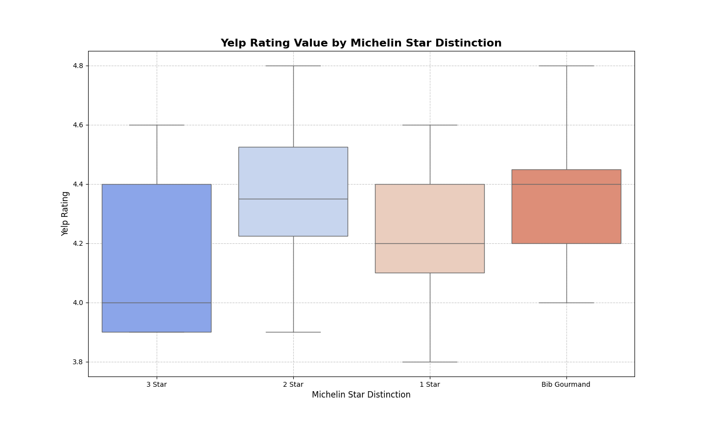
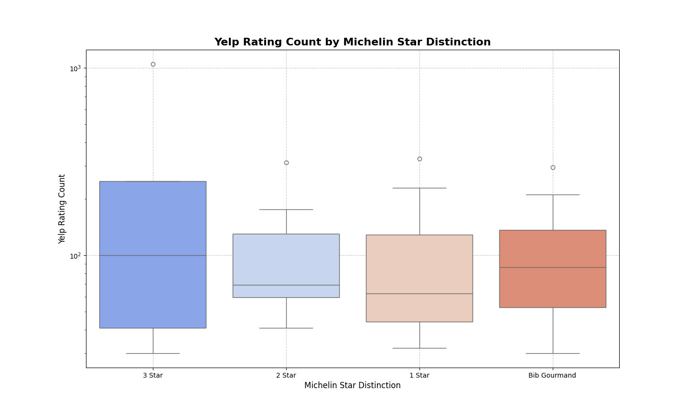
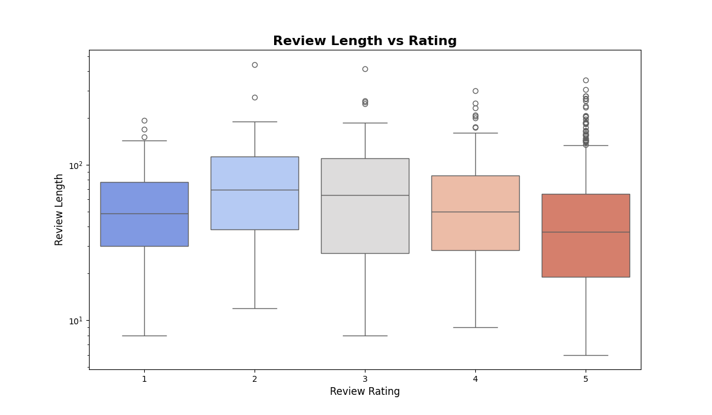
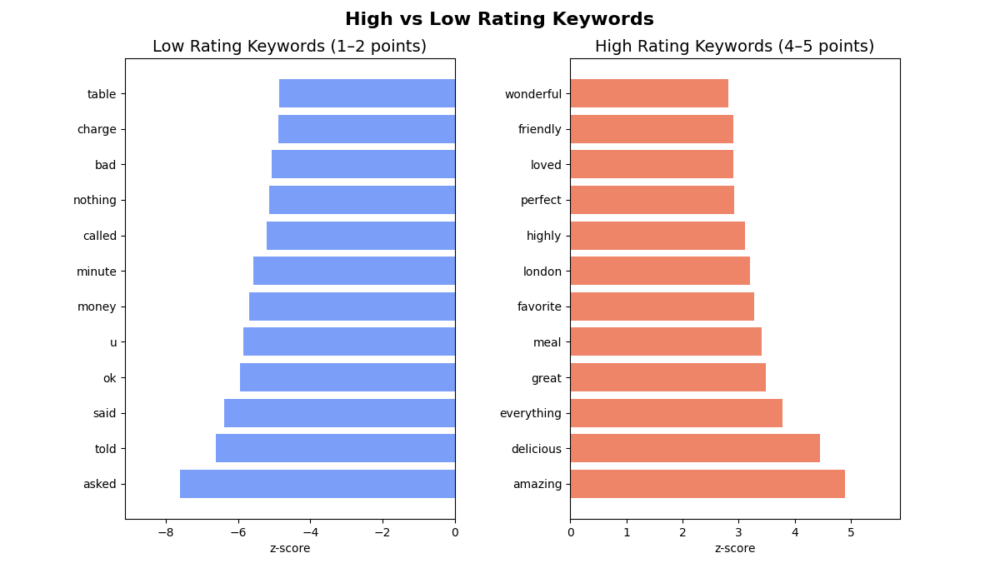

# Sentiment Analysis of Michelin Restaurants
### Michelin-Guide Restaurants vs Public Opinion in London

This project analyzes **881 Yelp reviews** from **58 Michelin-recognised restaurants (Michelin Stars and Bib Gourmand)** in London to evaluate whether **Michelin awards truly reflect what diners value**.

It is a portfolio-oriented adaptation of my **MSc Data Science** dissertation (University of Sheffield, 2024), rebuilt with a clean analytical workflow and reproducible code.

For the complete background, research design, hypotheses, and full methodology, please refer to **[DETAILS.md](DETAILS.md)**.

中文摘要請參見 **[中文摘要.md](中文摘要.md)**。

---

## Data and Sample
This study draws on Michelin Guide–recognised restaurants in London and their corresponding Yelp consumer reviews.

#### The dataset was constructed based on the following selection criteria:
- Geographic scope: Restaurants located in London only
- Review threshold: Each restaurant must have at least 30 Yelp reviews, ensuring a minimum level of consumer feedback reliability

#### Michelin recognition criteria:
- Michelin-starred restaurants are required to have maintained their star status continuously from 2022 to 2024
- Bib Gourmand restaurants are selected from the 2024 Michelin Guide

### Final Sample Composition
- Restaurant level (58 restaurants in total)
  - Michelin 3-star: 5 restaurants
  - Michelin 2-star: 8 restaurants
  - Michelin 1-star: 30 restaurants
  - Bib Gourmand: 15 restaurants
 
- Review level
  - Yelp reviews initially collected: 884
  - After data cleaning (removal of 3 duplicate entries): 881 valid reviews

The analytical design explicitly distinguishes between restaurant-level and review-level units of analysis in order to mitigate the impact of non-independent observations on statistical interpretation.

---

## Key Findings
- **Bib Gourmand restaurants show higher average Yelp ratings than Michelin-starred restaurants** (4.49 vs 4.24), suggesting stronger perceived value among diners.
- **Price level is not positively associated with customer sentiment** and shows a weak negative association with numerical ratings.
- **Text-based sentiment and numerical ratings are moderately aligned** (Spearman r ≈ 0.56), indicating that sentiment analysis captures meaningful satisfaction signals beyond star scores alone.
- **Negative consumer feedback consistently centres on service quality, waiting time, and value for money**, regardless of Michelin distinction.
- **Michelin recognition reflects culinary excellence**, but does **not uniformly translate into higher overall customer satisfaction** as expressed in online reviews.

---

## Results Overviews
### Exploratory Data Analysis (EDA)

#### Yelp Ratings by Michelin Distinction
Customer ratings show substantial overlap across Michelin categories.
While Michelin-starred restaurants generally receive high ratings, **higher star levels do not consistently correspond to higher Yelp scores**.
Bib Gourmand restaurants often achieve ratings comparable to, or higher than, Michelin-starred restaurants, suggesting that professional recognition and customer evaluation are not perfectly aligned.

#### Review Volume by Michelin Distinction
The number of Yelp reviews varies considerably across Michelin categories.
Bib Gourmand and Michelin 3-star restaurants attract relatively high volumes of reviews, indicating strong public interest and visibility.
This variation in review volume highlights the importance of considering both **rating values and review text**, rather than relying on numerical scores alone.

#### Review Length and Rating
Review length differs noticeably across rating levels.
Lower-rated reviews tend to be **longer and more detailed**, while higher-rated reviews are generally shorter.
This pattern suggests that dissatisfied customers are more likely to provide extended explanations of their experience, making textual analysis particularly valuable for understanding negative feedback.

#### Keyword Differences in Reviews
Text analysis reveals clear differences between high- and low-rated reviews.
High-rated reviews emphasise **food quality, enjoyment, and overall experience**, whereas low-rated reviews frequently mention **service issues, waiting time, and cost-related concerns**.
These keyword patterns are consistent across restaurant categories, indicating shared customer priorities regardless of Michelin distinction.

### Sentiment Analysis

### Topic Modelling

---

## Conclusions

This project compares Michelin Guide distinctions with public opinion expressed through Yelp reviews in London, using sentiment analysis and text analytics to examine how expert recognition aligns with customer experience.

The findings suggest that Michelin distinctions and customer evaluations are **partially aligned**, but not identical. While Michelin-starred restaurants are frequently associated with high food quality, customer satisfaction is strongly influenced by broader factors such as service quality, waiting time, and perceived value.

Numerical ratings and text-based sentiment generally move in the same direction, indicating that sentiment analysis provides a useful complementary signal to star ratings. However, discrepancies between ratings and sentiment highlight the importance of analysing review text rather than relying on numerical scores alone.

Bib Gourmand restaurants often receive higher customer ratings and are discussed in terms of comfort and value, whereas Michelin-starred restaurants are more commonly associated with fine-dining experiences and culinary techniques. These differences reflect varying customer expectations rather than a simple hierarchy of quality.

Overall, this study demonstrates how combining **ratings data with textual analysis** can provide a more nuanced understanding of customer experience than expert ratings or numerical scores alone.
